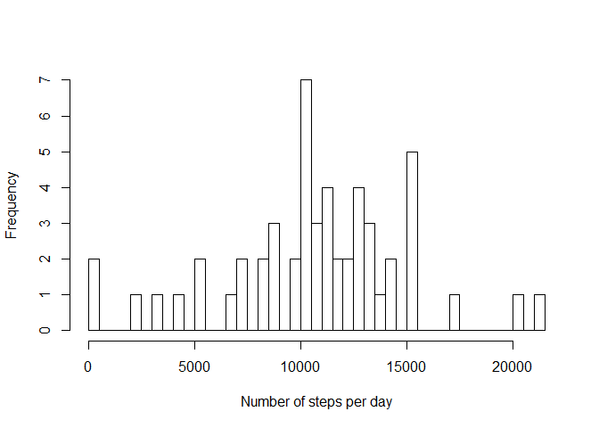
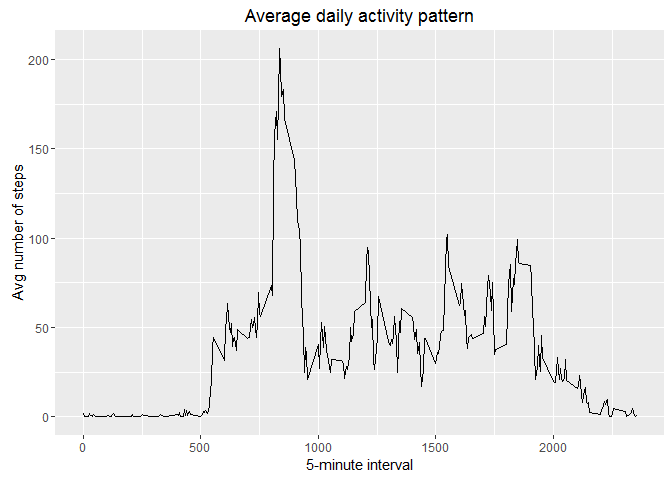
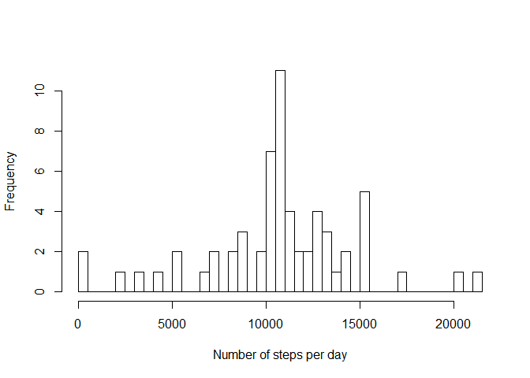
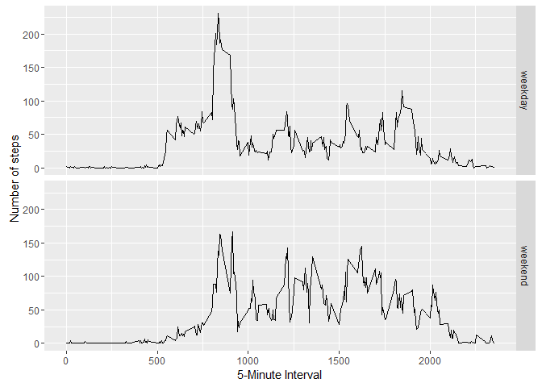

# Reproducible Research: Peer Assessment 1


## Loading and preprocessing the data


```r
##reading data into a data frame
rawData <- read.csv("activity.csv", header = TRUE)
##First columnn of this data frame contains 2304 missing values. We have to remove this.
##Removing missing values which are denote by "NA".

cleanData <- rawData[which(!(is.na(rawData$steps))), ]
```

## What is mean total number of steps taken per day?

```r
steps_Per_Day <- aggregate(steps ~ date, cleanData, sum)
colnames(steps_Per_Day) <- c("date", "number of steps")

hist(steps_Per_Day$`number of steps`, breaks = nrow(steps_Per_Day), main = " ", xlab = "Number of steps per day")
```



```r
##Calculating mean and median of the number of steps taken per day
mean_steps_per_day <- mean(steps_Per_Day$`number of steps`)
median_steps_per_day <- median(steps_Per_Day$`number of steps`)
```
## What is the average daily activity pattern?

```r
##aggrefating number of steps order by 5-minute interval
step_interval <- aggregate(cleanData$steps, FUN = mean, by = list(interval = cleanData$interval))
colnames(step_interval) <- c("interval", "mean_steps")

##generating time-series data
library(ggplot2)

x <- qplot(x = interval, y = mean_steps, data = step_interval, geom = "line", xlab = "5-minute interval", ylab = "Avg number of steps", main = "Average daily activity pattern")
print(x)
```



```r
##Which 5-minute interval, on average across all the days in the dataset, contains the maximum number of steps?
max_step_interval <- step_interval[which.max(step_interval$mean_steps), 1]
```
## Imputing missing values

```r
##Reporting total number of missing values
##The missing values are only in first column
missing_value_count <- sum(is.na(rawData$steps))

##filling missing values in dataset with the mean values of 5-minute interval
cleanData2 <- rawData
missing_value_indices <- which(is.na(rawData$steps))
for (i in missing_value_indices) {
  cleanData2[i, 1] <- step_interval[which(step_interval$interval == (cleanData2[i, 3])), 2]
}

##histogram of total number of steps taken each day
steps_Per_Day2 <- aggregate(steps ~ date, cleanData2, sum)
colnames(steps_Per_Day2) <- c("date", "number of steps")

hist(steps_Per_Day2$`number of steps`, breaks = nrow(steps_Per_Day2), main = " ", xlab = "Number of steps per day")
```



```r
##Calculating mean and median of the number of steps taken per day
##Mean is exactly same, but median has changed very minutely
mean_steps_per_day2 <- mean(steps_Per_Day2$`number of steps`)
median_steps_per_day2 <- median(steps_Per_Day2$`number of steps`)
##The imputation of missing values has not changed the mean and median drastically.
##Though the frequency of the intervals has increased as expected.
```
## Are there differences in activity patterns between weekdays and weekends?

```r
cleanData2$date <- as.Date(cleanData2$date)

day_of_week <- weekdays(cleanData2$date)

##converting day of the week to factor variable with two levels: weekday and weekend
day <- ifelse(day_of_week %in% c("Monday", "Tuesday", "Wednesday", "Thursday", "Friday"), "weekday", "weekend")

cleanData3 <- cbind(cleanData2, day = as.factor(day))

##Calculating the number of steps taken, averaged across all weekday days or weekend days (y-axis) and 5-minute interval
steps_by_weekday <- aggregate(cleanData3$steps, FUN = mean, by = list(interval = cleanData3$interval, day = cleanData3$day))
colnames(steps_by_weekday) <- c("interval", "day", "avg_steps")

g <- ggplot(steps_by_weekday, aes(steps_by_weekday$interval, steps_by_weekday$avg_steps))
g <- g + geom_line() + facet_grid(day~.) + labs(y = "Number of steps", x = "5-Minute Interval")
print(g)
```


